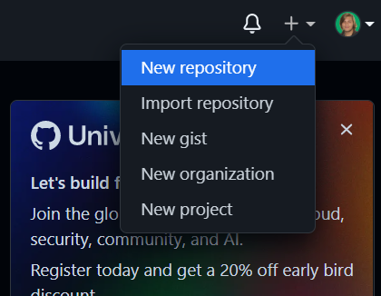
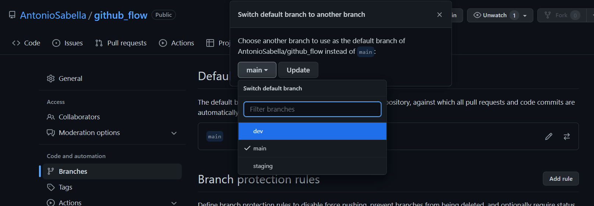
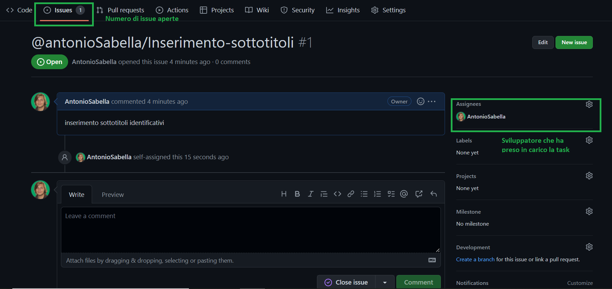
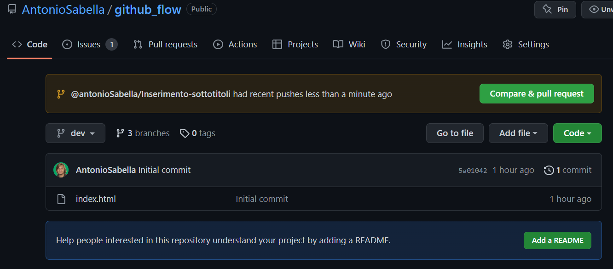
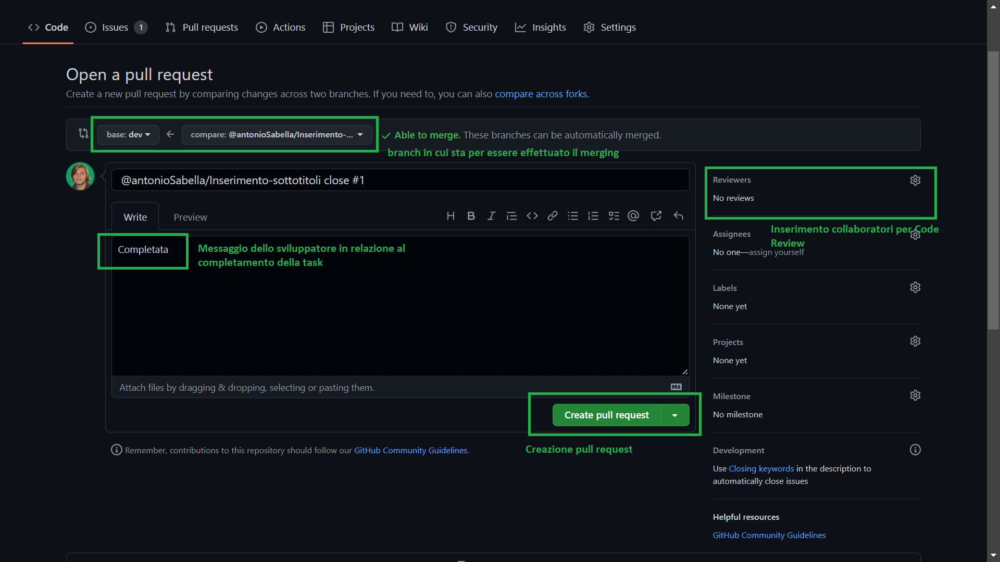
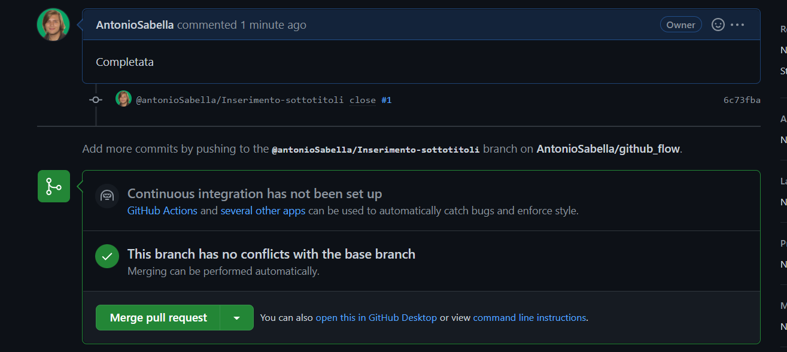

# GITHUB WORKFLOW

## Creazione repo remota
  
### 1. Sul profilo personale github cliccare l'icona "+" in alto a destra e creare una nuova repository



### 2. Sancire il nome della repo, settare criteri di visibilità(Pubblica o Privata), valutare l'eventuale aggiunta di file README e, infine, creare la repository


### 3. A questo punto si accederà alla repository vuota e sarà possibile effettuare tre tipologie di azioni: 
  1. [A] Inizializzare una nuova repo locale tramite riga di comando; 
  2. [B] Pushare una repo esistente dalla riga di comando; 
  3. [C] Importare un progetto da un'altra repository. 


## Inizializzazione repo locale

Al fine di inizializzare una repo locale è possibile eseguire i comandi descritti sopra {1. [A]}


Il risultato finale dell'operazione conterrà il progetto locale inserito nella repo remota, così come segue:


## Creazione branch principali per suddividere lo sviluppo dalla produzione

L'approccio organizzativo ai progetti e la suddivisione delle branch principali è una pratica volta a suddividere la PRODUZIONE dallo SVILUPPO, per meglio gestire il flusso di lavoro.
In tal modo sudduvidiamo le branch in:
1. MAIN - Branch principale che farà riferimento al progetto in produzione e in cui si mergerà solo dopo attenta code review e testing
2. STAGING - Branch intermedia che andrà considerata come branch di produzione per gli sviluppatori, in cui periodicamente si andrà a mergiare la branch di sviluppo pura
3. DEV - Branch di sviluppo da cui si distaccheranno le sotto-branch per inserimento fi feature singole da implementare nel progetto
4. @nomeSviluppatore/featureDaImplementare - queste saranno le sotto-branch da implementare nel DEV, le quali saranno soggette a code review pre-merging

Le branch possono essere create in due modi:
- Dall'interfaccia Github;
- Da riga di comando.

### Creazione branch principali da interfaccia github


!!NOTA: Se si decide di optare per la creazione da interfaccia, una volta tornati sul progetto locale, per ottenere la branch remota bisogna lanciare il comando
```
git pull
```
ottenendo il seguente risultato nel terminale (con il riferimento alle branch pullate in locale)


a questo punto è possibile switchare nella nuova branch pullata


### Creazione branch principali da riga di comando

Per creare una nuova branch da riga di comando lanciare il seguente comando


Successivamente è possibile pubblicare direttamente la nuova branch


oppure effettuare delle modifiche alla nuova branch e pusharle insieme ad essa mediante la sequenza:

```
git add .

git commit -m"descrizione commit"

git push -u origin <branch in cui ci si trova>
```

## Descrizione workflow (flusso di lavoro)

Una volta che le branch principali sono state strutturate, è necessario seguire determinati passaggi per meglio identificare lo storico dei commit e delle modifiche apportate al progetto.

!!NOTA: Ricordarsi di distaccare sotto-branch di implementazione dalla branch principale di sviluppo DEV.

!!NOTA: Buona pratica è quella di rendere la branch DEV di default, così da non incappare in sviste/errori di merging in altre branch.
Al fine di ottenere tale scopo eseguire i seguenti passaggi:

1. Nell'ambiente della repo cliccare su Settings (in alto a destra)
2. Nella sezione Branches troveremo la branch di default main
3. Switchare su branch dev

4. Cliccare su Update per settare la branch di default su dev
In questo modo ogni volta che si andrà ad effettuare una pull request per le sotto-branch di implementazione, queste ultime avranno come destinazione di merging automatica dev.


### Definire Issue da assegnare e completare 

Prima di iniziare a lavorare su qualsiasi feature/task buona pratica è quella di sancire delle issue nella sezione apposita nella pagina principale della repository.
- Cliccare campo Issues 
- Cliccare New Issue
- Inserire nome in formato 
```
@nomeSviluppatore/featureDaImplementare
```
- Inserire una descrizione quanto più accurata possibile della feature da implementare
- Cliccare su Submit Issue
- Assegnare la issue a colui che la prenderà in carico
- !!FACOLTATIVO: Buona pratica dopo l'assegnazione è quella di inserire un commento con l'intenzione di prenderla in carico

Una volta che la issue è stata assegnata il risultato completo sarà il seguente:



A questo punto è possibile tornare sul progetto locale e creare una nuova branch con il titolo della issue, in questo caso:

```
git checkout -b @antonioSabella/Inserimento-sottotitoli
```
!!NOTA: l'ideale è quello di copiare il titolo per evitare di incappare in typo

### Push delle modifiche della sotto-branch di implementazione

Ultimato il lavoro sulla branch è ora possibile effettuare i passaggi canonici per effettuare il push delle modifiche:

```
git add .

git commit -m"nome branch aperta/feature close #enumerazione automatica azioni github"
!!NOTA: In questo caso il close, una volta creata la pull request, approvata e mergiata, chiuderà automaticamente la issue. 

git push -u origin <branch in cui ci si trova>
```

Una volta pushata la branch di modifica, sulla pagina principale della repo sarà visibile la pull request e sarà possibile cliccare per crearla:



Una volta cliccato completare i vari campi della pull reuqest e infine crearla



Se non sopraggiungono conflitti è possibile effettuare il merge



Una volta mergiata la sotto-branch di implementazione la issue correlata verrà chiusa automaticamente

Dopo aver effettuato il merge della sotto-branch di implementazione, ricordarsi di spostarsi sulla branch di sviluppo e pullare le modifiche mergiate

```
git checkout dev

git pull
```

## Considerazioni Finali

1. In caso di problematiche lanciare il comando
```
git status
```
